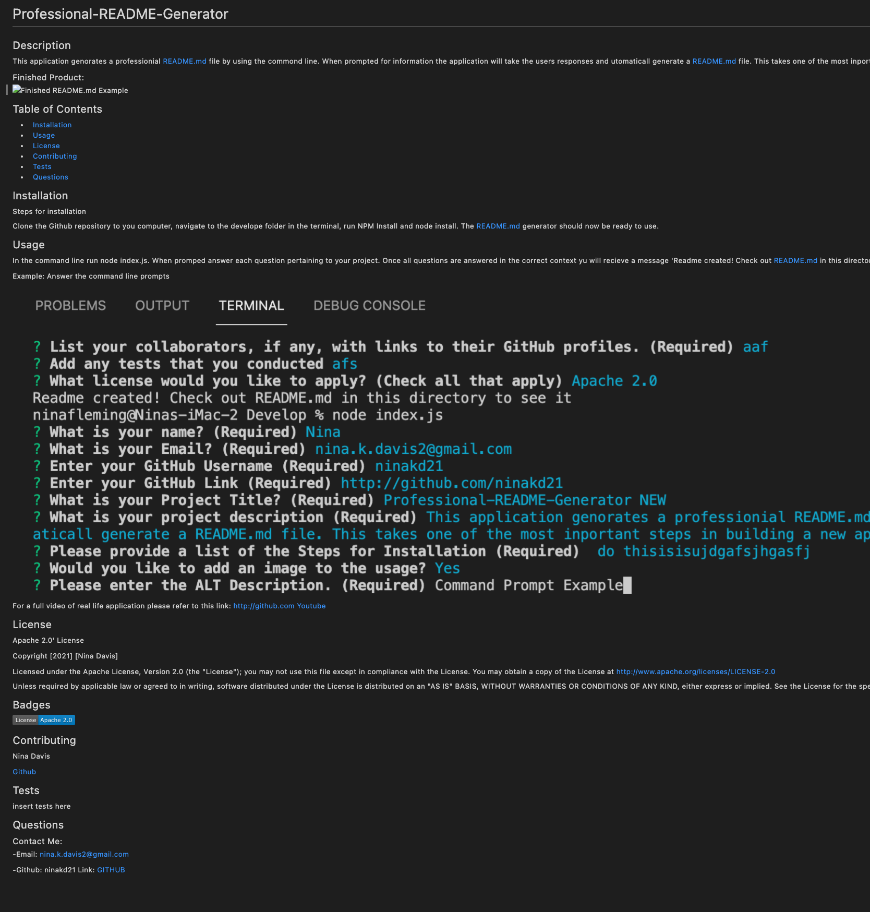
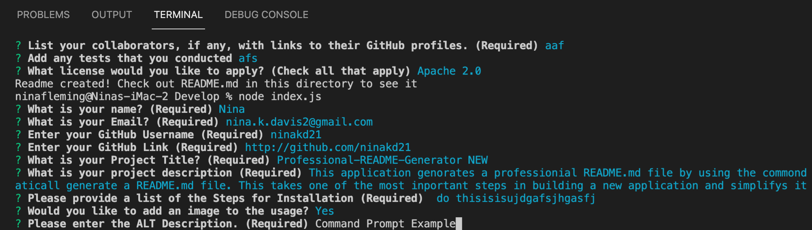

# Professional-README-Generator

## Description 

This application genorates a professionial README.md file by using the commond line. When prompted for information the application will take the users responses and utomaticall generate a README.md file. This takes one of the most inportant steps in building a new application and simplifys it for a fast and professionsal file. 
Finished Product:

## Table of Contents 

* [Installation](#installation)
* [Usage](#usage)
* [License](#license)
* [Contributing](#contributing)
* [Test](#test)
* [Questions](#questions)

## Installation

Steps for installation

Clone the Github repository to you computer, navigate to the develope folder in the terminal, run NPM Install and node install. The README.md generator should now be ready to use. 

## Usage 

In the command line run node index.js. When promped answer each question pertaining to your project. Once all questions are answered in the correct context yu will recieve a message 'Readme created! Check out README.md in this directory to see it'. If you recieve an error message, please adress the referred issues and try again. 

Example: Answer the command line prompts

For a full video of real life application please refer to this link: https://youtu.be/hEASVeRISJ8
[Youtube](https://youtu.be/hEASVeRISJ8)

## License

The last section of a good README is a license. This lets other developers know what they can and cannot do with your project. If you need help choosing a license, use [https://choosealicense.com/](https://choosealicense.com/)

## Badges

## Contributing

Nina Davis http://github.com/ninakd21 
[Github](http://github.com)

## Tests

Go the extra mile and write tests for your application. Then provide examples on how to run them.

## QUESTIONS

Contact Me: 

-Email: nina.k.davis2@gmail.com

-Github: Nina Davis http://github.com/ninakd21 [Github]
